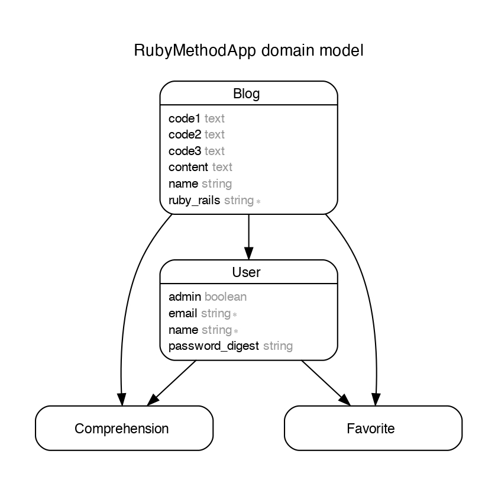

# アプリ名
RUBYメソッド辞典

# なぜ作ったのか
ネットで探したメソッドやあんまり使わないメソッドは、すぐに忘れてしまうからです。  
メモ帳として書いておいたメソッドは後で確認することで、勉強になると思っています。

# DEMO画像


# 使い方
1. ログインしてください。
2. 記事作成をクリックしてメソッドを記入してください。
3. メソッド一覧から作成したメソッドをクリックしてください。
4. お気に入りボタンをクリックするとお気に入りページにメソッドが表示されます。
5. チェックを入れるをクリックするとメソッド一覧にチェックが入ります。
6. メソッドの詳細の下部にメソッドの編集を削除のリンクがあります。

# 開発言語
- Ruby 3.1.3
- Rails 6.1.7
- PostgreSQL

# URL
Herokuによるデプロイ  
https://aqueous-citadel-58340.herokuapp.com/

# clone
```
% git@github.com:cclemon3248/ruby_method_app.git
% cd ruby_method_app  
% bundle install  
% rails db:create  
% rails db:migrate  
% rails db:seed
% rails s
```

## ER図

